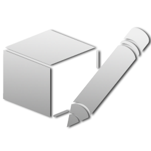
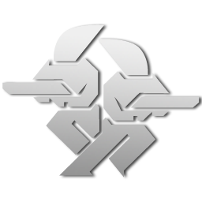
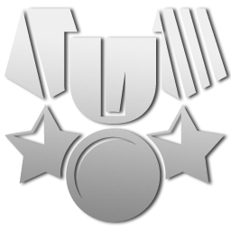
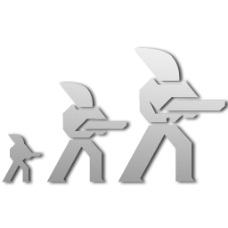

Red Eclipse has a variety of different game modes to choose from, with mutators to further tweak the experience. This page gives an overview of all the available modes and mutators. For further information and game strategy, see [Mutator Tips](Mutator_Tips "wikilink") and the articles about each of the below game modes.

## Modes

|                                                                                     |                                                     |                                                                                                                                                                                                                                                                                                                                                    |
|-------------------------------------------------------------------------------------|-----------------------------------------------------|----------------------------------------------------------------------------------------------------------------------------------------------------------------------------------------------------------------------------------------------------------------------------------------------------------------------------------------------------|
|           | [Editing](Main_Page#Map_Editing "wikilink")         | Make your own custom maps.                                                                                                                                                                                                                                                                                                                         |
|  | [Deathmatch](Deathmatch "wikilink")                 | Kill other players to score points using the [deathmatch scoring](Deathmatch_Scoring "wikilink") system. The player or team with the most points at the end wins!                                                                                                                                                                                  |
|           | [Capture-the-flag](Capture "wikilink")              | Steal the other team's flag and return it to your base, without letting them take yours, to score points. Players that defend or escort their flag benefit from a powerful [buff](Status_effects#buffs "wikilink"), but not the flag carrier, who will move 10% slower.                                                                            |
|              | [Defend-and-control](Defend-and-control "wikilink") | Stand near control points to secure them. Each control point you hold brings in a steady stream of points. While defending a secured control point players receive a powerful [buff](Status_effects#buffs "wikilink"). Before enemy control points can be secured, they are overthrown to a neutral state.                                         |
|              | [Bomber-ball](Bomber-ball "wikilink")               | Grab the ball and deliver to the enemy base to score, but watch your bomb timer - it will explode if you hold on to it too long. Pass it to your teammates (with the **F** key) to keep it going. If the other team holds it, kill the carrier or intercept it midair. Players defending their base get [buffed](Status_effects#buffs "wikilink"). |
|                    | [Race](Race "wikilink")                             | Compete in a race for the most number of laps, carefully managing your limited impulse and executing various [parkour moves](impulse_moves "wikilink").                                                                                                                                                                                            |

## Mutators

|                                                                                  |             |                                                                                                                                                                                                                                                     |
|----------------------------------------------------------------------------------|-------------|-----------------------------------------------------------------------------------------------------------------------------------------------------------------------------------------------------------------------------------------------------|
|  | *Multi*     | Play with four teams instead of two.                                                                                                                                                                                                                |
|                    | *FFA*       | There are no teams, just every player for themselves in a free-for-all showdown. (Not available in CTF, DTF, or Gauntlet, and in Bomber Ball it implies the *hold* mutator)                                                                         |
|                 | *Coop*      | All human players are forced onto the same team, battling against a team of bots...and there are more of them than there are of you.                                                                                                                |
|     | *Instagib*  | Players spawn with 1 HP, so any hit is lethal. Unless *medieval* or *kaboom* is also selected, players only have rifles for weapons.                                                                                                                |
|     | *Medieval*  | Players only have swords for weapons.                                                                                                                                                                                                               |
|           | *Kaboom*    | Players only have grenades and mines for weapons.                                                                                                                                                                                                   |
|                 | *Duel*      | Only two players spawn at a time. Other players spectate the two fighting and wait their turn in line before playing again. Winner respawns the next round, loser goes to the back of the line. Beat your opponents the most to win the match.      |
|     | *Survivor*  | Similar to duel, but all players spawn at once. Last player or team standing wins.                                                                                                                                                                  |
|        | *Classic*   | Instead of having a menu to select your weapons from, you spawn with only a pistol. The rest of the weapons can be found on the ground, scattered across the map.                                                                                   |
|  | *Onslaught* | Enemy drones and sentry turrets spawn in the maps while you fight against other players. If one of them kills you, you lose points!                                                                                                                 |
|  | *Freestyle* | Disables all impulse costs and the impulse count rule, so players can do unlimited parkour without even touching ground.                                                                                                                            |
|        | *Vampire*   | Dealing damage to opponents causes you to regain your own health.                                                                                                                                                                                   |
|           | *Resize*    | As your health decreases, you get smaller and start slowing down, and the converse is true for gaining health. If combined with *instagib*, instead you get bigger every time you kill someone, until getting killed takes you back to normal size. |
|                 | *Hard*      | No regeneration and radar.                                                                                                                                                                                                                          |
|           | *Basic*     | No collectible items will spawn in the arena.                                                                                                                                                                                                       |

## Mode-Exclusive Mutators

### Capture the Flag

|                                                                                                 |           |                                                                                                                                              |
|-------------------------------------------------------------------------------------------------|-----------|----------------------------------------------------------------------------------------------------------------------------------------------|
|        | *Quick*   | Touching your own team's loose flag will instantly teleport it back to your base, instead of having to escort it there on foot.              |
|     | *Defend*  | When your flag is taken, you cannot return it. You must protect it from where it's dropped until the timer resets.                           |
|  | *Protect* | You do not score for bringing a flag back to your base. Instead, simply pick up an opponent's flag and hold onto it for 15 seconds to score. |

### Defend and Control

|                                                                                        |         |                                                                                                                                                                         |
|----------------------------------------------------------------------------------------|---------|-------------------------------------------------------------------------------------------------------------------------------------------------------------------------|
|  | *Quick* | Flags can be secured much more quickly. When capturing enemy points, they change directly to your color, instead of passing through a neutral "overthrown" state first. |
|     | *King*  | There is only one control point, usually in the middle of the map.                                                                                                      |

### Bomber Ball

|                                                                                           |          |                                                                                                                                                                                                                                                                                                    |
|-------------------------------------------------------------------------------------------|----------|----------------------------------------------------------------------------------------------------------------------------------------------------------------------------------------------------------------------------------------------------------------------------------------------------|
|  | *Basket* | The ball must be thrown into the goal to score, using the **F** key at a minimal distance.                                                                                                                                                                                                         |
|        | *Hold*   | There are no goals to drop the ball into. Instead, you get points for holding the ball as long as possible, but don't let the timer run out or you blow up and lose points! In this mode, the player holding the ball can kill opponents to reset the timer, allowing them to hold onto it longer. |
|  | *Attack* | The ball spawns at a teams base and they attack for half the round, then it swaps over.                                                                                                                                                                                                            |

### Race

|                                                                                              |             |                                                                                                                                                                                             |
|----------------------------------------------------------------------------------------------|-------------|---------------------------------------------------------------------------------------------------------------------------------------------------------------------------------------------|
|              | *Timed*     | Compete for the fastest time completing a lap. The number of laps does not matter.                                                                                                          |
|  | *Endurance* | Disables impulse restoration on checkpoints and when respawning. Also slows down impulse recovery, so plan your route carefully.                                                            |
|     | *Gauntlet*  | One team (blue/Alpha) races to reach the goal and score points, while the other team (red/Omega) tries to shoot them before they can get there. Teams switch off halfway through the match. |

