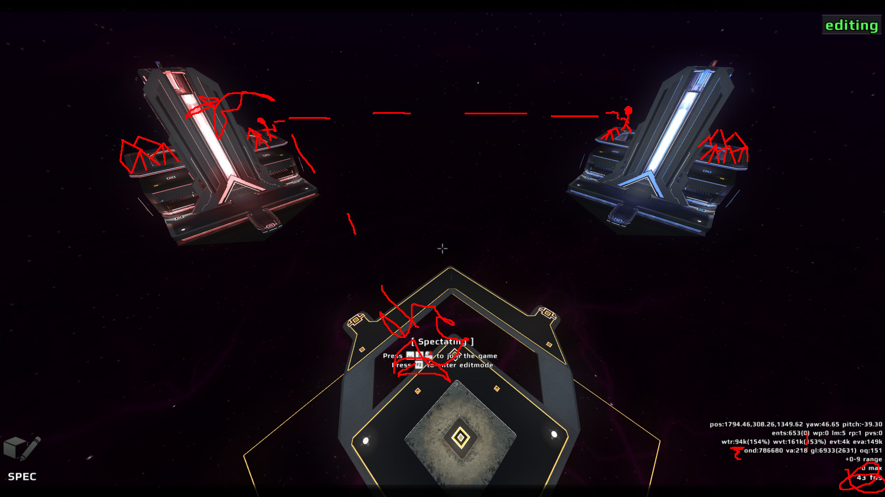
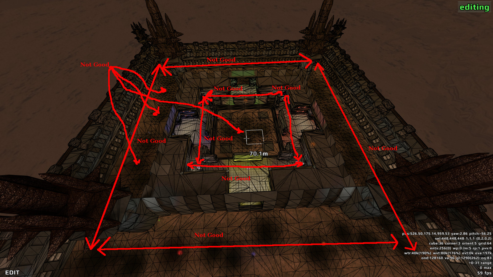
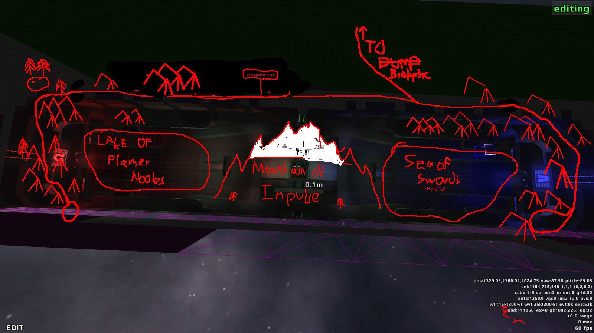
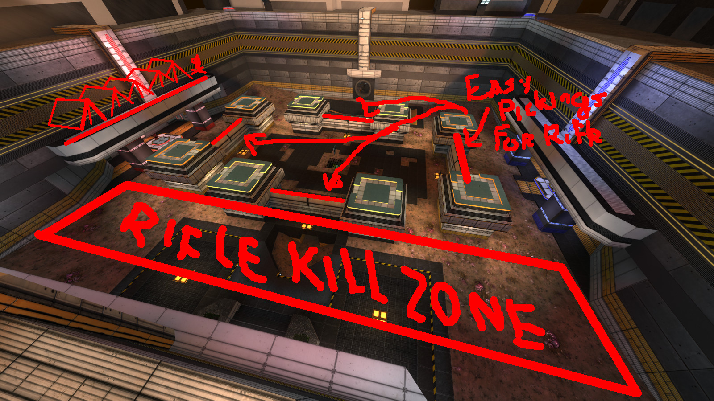
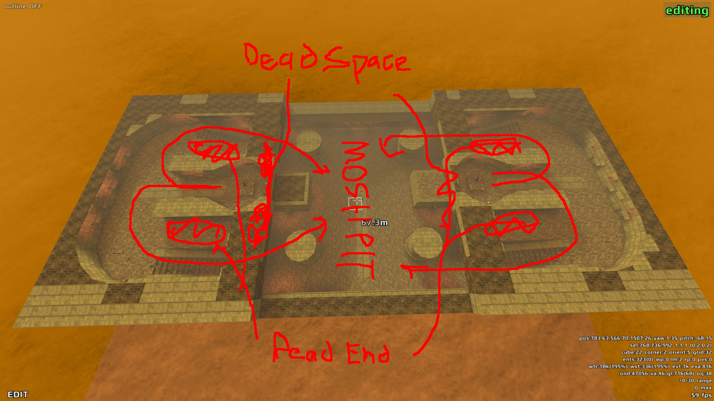

With Red Eclipse 2.0 looming on the horizon, a lot of changes are being made.

This page will be frequently edited to reflect the current ideology of the developers.

### **Engine**

------------------------------------------------------------------------

Red Eclipse is moving to the Tesseract engine. The Tesseract engine is a totally redone fork of the Cube 2 engine and supports features such as volumetric lighting, dynamic lighting, realtime reflections, and realtime shadows. While it requires more GPU shading power than the Cube 2 engine, it is much more efficient CPU-wise and is a much more capable engine overall.

### **Maps**

------------------------------------------------------------------------

As Molexted likes to refer to it, the "dumpster fire of maps" will be cleaned up.

Maps that do not fit these criteria will be removed / rejected:

-   Does not fit the general style, lore or direction of the game.

<!-- -->

-   The map layout does not flow well or is too simple / too open for the current game physics.

<!-- -->

-   The quality of the map is poor (poor details, repetitive textures, rampant bugs) and no remake is in the pipeline.

<!-- -->

-   The general concensus points to people not liking the map

Some of the maps in this list have been reworked and have been marked as such. Otherwise, you can find the reason for its removal next to it.

## Maps being added

-   Polaris
    -   Duel map, very small, set far to the north in the mountains. 4 rooms, asymmetrical, no rocket.
-   Plantation
    -   Large FFA/DAC map, asymmetrical, made a couple years ago by Rabidbutton

## Maps to be kept, no change

-   Conflict
    -   Keep as-is, despite marginal layout
-   Darkness
    -   Keep as-is
-   Decay
    -   Keep as-is
-   Fatal Error
    -   Keep as-is
-   Nova
    -   Keep as-is
-   Octavus
    -   Keep as-is or with remix
-   Suspended
    -   Keep as-is, may recieve facelift
-   Ubik
    -   Keep as-is, may recieve facelift/optimization
-   Wet
    -   Probably keeping as-is, despite somewhat plain layout

## Maps to be kept, have a remix

-   Abuse
    -   Has remix: Toxic Abuse
-   Panic
    -   Remix made: Tau
-   Pumpstation
    -   Keeping as team map only, has remix

## Maps to be kept, need a remix

These maps have adequate layouts; however, they do not meet Red Eclipse's art standards or its art direction.

-   Bloodlust
    -   Has a remix in the pipeline: Bioluminescence
-   Cargo
    -   Undecided, badly needs a remix to stay
-   Castle
    -   Removed, unless Molexted comes up with something
-   Center
    -   Remix is planned
-   Deli
    -   Keep with a remix
-   Depot
    -   Remix is planned
-   Dutility
    -   Quin's baby
-   Enyo
    -   Keep with a remix
-   Ghost
    -   Keep with a remix, ghost-esport
-   Institute
    -   Undecided
-   Livefire
    -   Keep with a remix
-   Tribal
    -   Keep with a remip and remix

## Maps under consideration

These maps have relatively poor layouts but may be kept due to a shortage of maps or popular demand.

-   Affluence
    -   Undecided, simple layout
-   Canyon
    -   Undecided, poor terrain geometry and middling layout
-   Discontinuity
    -   Undecided
-   Erosion
    -   Undecided, confusing layout
-   Longestyard
    -   Undecided, very small, simple, and ugly, but popular

------------------------------------------------------------------------

-   Tonaituh
    -   May require special marking as a "bonus map" as was originally intended; not a pure speed race map due to multiple corridors, and does not fit theme

## Maps marked for removal

These maps are poorly laid out, making them impossible to fix. They may also have very poor texturing, but layout is the primary reason for dropping these maps.

-   Ares
    -   Removed, does not fit the theme of the game and the layout is too open. It is thus unsalvageable
-   Bath
    -   Removed, layout is unsalvageable
-   Battlefield
    -   Removed, terrain unsuitable for current physics
-   Biolytic
    -   Removed, people do not enjoy it due to confusing, unbalanced layout
-   Campgrounds
    -   Removed, very poor port of a Quake 3 Arena map, fugly
-   Cutec
    -   Removed, layout is too open

-   Deadsimple
    -   Removed, poor quality, poor layout, people do not like it

-   Deathtrap
    -   Removed, poor quality
-   Dropzone
    -   Removed, too linear

-   Echo
    -   Removed, poor layout

-   Futuresport
    -   Removed, poor layout
-   Keystone 2000
    -   Removed, poor layout, poor quality (could be kept as a multi map if enough people complain)
-   Mist
    -   Removed, poor layout, fugly
-   Oneiroi
    -   Removed, unplayable due to openness and low gravity
-   Processing
    -   Remove? Looks pretty terrible and layout is confusing
-   Spacetech
    -   Remove, very flat, boring texturing and open, rifle friendly layout
-   Stone
    -   Layout is Not Good

-   Tower
    -   Remove, fugly, poor layout
-   Vault
    -   Remove, unpopular, poor layout
-   Venus
    -   Remove, performance problems and too open

------------------------------------------------------------------------

-   Relax
    -   For a beginner race map, very disorienting and has little room for improvement

\[List is incomplete, please help molex\] All maps that do not make the final cut will be available in the "Additions pack".
