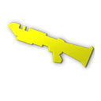
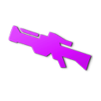
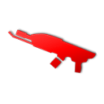
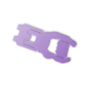
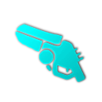

In most games all players are equipped with a pistol and two of their favorite loadout weapons. Furthermore, explosive weapons can be collected in the arena, such as grenades, mines and rockets, unless these are disabled via the [basic](mutator_Tips#basic "wikilink")'' mutator.

## Loadout weapons

These weapons can be chosen in the *profile* game menu, and it is even possible to change the weapon selection mid-match by pressing the *comma* key (per default). Note that one or both of the loadout weapon slots can be randomized. All of loadout weapons come with an unlimited supply of ammo, but must be reloaded when the clip is empty. Each weapon has two unique fire modes.

|                                     |                                                                                                                                          |
|------------------------------------:|------------------------------------------------------------------------------------------------------------------------------------------|
|  [40px](file:classic.png "wikilink")| *Exception*: When the [classic](Mutator_Tips#classic "wikilink") game mutator is active, loadout weapons must be collected in the arena. |

|                                                                                                                                                                                                                                                                  |                                                                                      |
|------------------------------------------------------------------------------------------------------------------------------------------------------------------------------------------------------------------------------------------------------------------|--------------------------------------------------------------------------------------|
| [40px](file:medieval.png "wikilink") [40px](file:swordcol.png "wikilink") [40px](file:kaboom.png "wikilink") [40px](file:grenadecol.png "wikilink")[40px](file:minecol.png "wikilink") [40px](file:instagib.png "wikilink") [40px](file:riflecol.png "wikilink") | Some game [mutators](Mutator_Tips "wikilink") force players to use specific weapons. |

### Weapon combos

 *Shotgun and Rifle*

This traditional choice of loadout weapons is very popular, especially in [Deathmatch](Deathmatch "wikilink"), [Capture-the-flag](Capture-the-flag "wikilink"), [Defend-and-control](Defend-and-control "wikilink"), and [Bomber-ball](Bomber-ball "wikilink") games. A player with these tools of destruction prioritizes the ability to inflict heavy damage - any time, anywhere, and over any distance.

 *Flamer and Zapper*

This pair of weapons optimizes a players ability to outrun and annoy his enemies and to support his team mates. It serves well for hit-and-run tactics, not only in [Capture-the-flag](Capture-the-flag "wikilink") games. It is also very effective at getting enemies to waste time telling you in chat how "nooby" your weapon loadout is and attempt to convince you that other (read: shotgun/rifle) loadouts are what you "should" be using.

 *Plasma and Zapper*

This pair of weapons optimizes the chances of being kicked by people who don't find getting shredded by "noob" weapons funny. The best way to exploit this is by teamkilling with plasma2 and accidentally using zapper2 on teammates.

This combo can really be very effective since the vast majority of duelists are used to facing the rifle/sword or rifle/shotgun combo.

## Explosives

Explosive weapons can be collected from certain spots of the arena. Unlike other weapons, they cannot be reloaded.

 Exception: In [kaboom](Mutator_Tips#kaboom "wikilink") games, players start with grenades and mines that reload over time.

## Spawn weapons

Spawn weapons are available to all players in addition to the chosen loadout weapons. This includes a pistol and the option to use parkour moves as melee attacks.

## Weapon Mechanics

### Status effects

Some weapons induce status ailments that inflict some damage over time and last for about five seconds. Useful to delay enemy health recovery. Multiple effects can be stacked.

|                                   |                                                                                                                                                                                                                                                                                                                                                             |
|-----------------------------------|-------------------------------------------------------------------------------------------------------------------------------------------------------------------------------------------------------------------------------------------------------------------------------------------------------------------------------------------------------------|
| [64px](file:shock.png "wikilink") | *Shock*- Slows down movement greatly. Deals 2 damage per second. Caused by the [20pxzapper](file:zappercol.png "wikilink") and by [20pxmines](file:minecol.png "wikilink").                                                                                                                                                                                 |
| [64px](file:burn.png "wikilink")  | *Burn*- Deals 3 damage per second. Can be negated with the secondary fire of the [20pxflamer](file:flamercol.png "wikilink") or by entering water (as long as you are at least half submerged). Caused by [20pxgrenades](file:grenadecol.png "wikilink"), [20pxrockets](file:rocketcol.png "wikilink") and the [20pxflamer](file:flamercol.png "wikilink"). |
| [64px](file:bleed.png "wikilink") | *Bleed*- Deals 3 damage per second. Caused by the secondary fire of the [20pxshotgun](file:shotguncol.png "wikilink") and by the [20pxsword](file:swordcol.png "wikilink").                                                                                                                                                                                 |

### Anatomy

The player model is split into 3 parts which determine how much damage is applied to them: head, torso and legs. All damage values determined by the weapon specific variables apply to the head. The torso and legs then take a variable percentage of that damage value, sometimes higher (like the flamer's secondary fire) but usually smaller than the head damage.

### Weapon variables

When playing offline or as a server [operator](privileges "wikilink"), almost all aspects of game rules can be tuned and modified using the [console](console "wikilink") to control thousands of [variables](variables "wikilink"). This includes a large [array of variables](Vars_and_Commands_Tables "wikilink") for each weapon that give you deep control of the weapon characteristics.

-   [Melee Variables](Melee_Vars "wikilink")
-   [Pistol Variables](Pistol_Vars "wikilink")
-   [Sword Variables](Sword_Vars "wikilink")
-   [Shotgun Variables](Shotgun_Vars "wikilink")
-   [SMG Variables](SMG_Vars "wikilink")
-   [Flamer Variables](Flamer_Vars "wikilink")
-   [Plasma Variables](Plasma_Vars "wikilink")
-   [Zapper Variables](Zapper_Vars "wikilink")
-   [Rifle Variables](Rifle_Vars "wikilink")
-   [Grenade Variables](Grenade_Vars "wikilink")
-   [Mine Variables](Mine_Vars "wikilink")
-   [Rocket Variables](Rocket_Vars "wikilink")

### Weapon IDs

Weapon numbers or IDs are used for certain variables, for instance when defining the weapon for the instagib game mutator or when referring to some particle presets. The following table gives a compact overview of the available weapons slots and their IDs. For some variables, such as *fragweap*, an additional ID refers to the secondary fire mode.

|           |                                     |                                          |                                      |
|-----------|-------------------------------------|------------------------------------------|--------------------------------------|
|           | align="center" colspan=2|spawn      | align="center" colspan=7|loadout weapons | align="center" colspan=3|explosives  |
| weapon    | [32px](file:clawcol.png "wikilink") | [32px](file:pistol.png "wikilink")       | [32px](file:swordcol.png "wikilink") |
| primary   | 0                                   | 1                                        | 2                                    |
| secondary | 13                                  | 14                                       | 15                                   |

### Frag and flak vars

Variables related to flak or fragmentation give a plethora of options for creating weapon mods. However, the use of these variables can be rather confusing.

-   In essence, when the projectile of a weapon is destroyed (impact or expired lifetime), new flak projectiles can be created (fragmentation).
-   The corresponding *fragweap* variable defines which type of projectiles are created according to a [\#weapon ID](#weapon_ID "wikilink") (none for -1).
-   Further *frag* variables define the number and dynamics of these projectiles.
-   A large array of *flak* variables has defaults inherited from their base weapon variables.
-   These *flak* variables define many properties of flak projectiles. The variable names refer to the type of flak created (the ID used for *fragweap*), not the type of parent projectile.

## Gallery

<File:Pistol> player.jpg |Pistol <File:Sword> player 2.jpg |Sword <File:Shotgun> player.jpg |Shotgun <File:SMG.jpg> |SMG <File:Flamer> player.jpg |Flamer <File:Plasma> player.jpg |Plasma <File:Zapper.jpg> |Zapper <File:Rifle> player.jpg |Rifle <File:Grenade> player.jpg |Grenade <File:Rocket> player.jpg |Rocket <File:Mine> player.jpg |Mine
